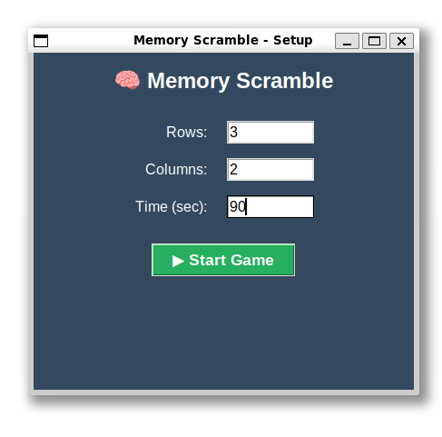
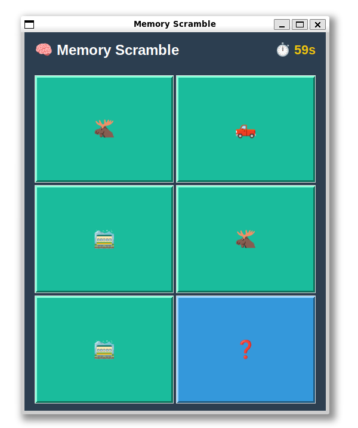
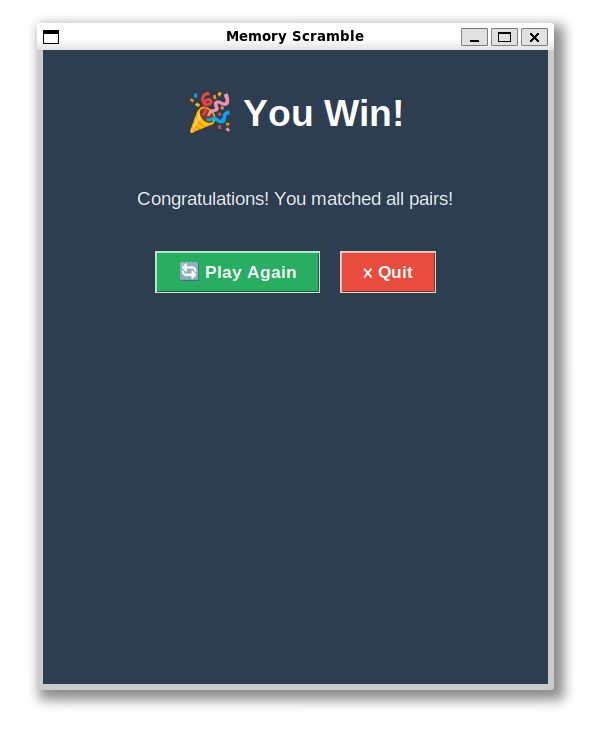
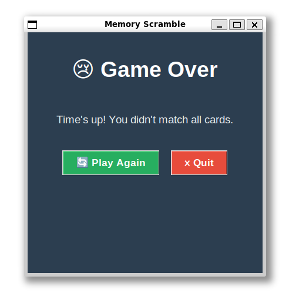

# Memory Scramble Game

This is our implementation of the Memory Scramble game for the Software Construction course. The idea is simple - you flip cards and try to remember where the matching pairs are. Its basically the classic memory card game but with emojis.

## What is this game about

Memory scramble is a game where all cards are placed face-down on a board. The player clicks two cards to flip them. If they match, they stay face-up. If not, they flip back and you have to remember where they were. The goal is to match all pairs before the time runs out.

We built this using Python and Tkinter for the GUI. We chose Tkinter because it comes built-in with Python so you dont need to install anything extra which makes it easier to run on any machine.

## Game Features

- The player can choose the board size (number of rows and columns). The only rule is that the total number of cells has to be even so we can make pairs
- The player sets a time limit before starting. You can make it short for a challenge or longer if you want to take it easy
- Theres a countdown timer shown at the top of the screen while you play so you always know how much time you have left
- If the timer hits zero and you havent matched everything, it shows a game over message
- When you flip two cards that match they stay visible. When they dont match they flip back after a short delay
- The emojis are generated dynamically from unicode so it supports any board size you want, even really big ones
- After you win or lose theres a play again button so you can try different settings without restarting the program

## Requirements

- Python 3.8 or newer (we developed it on 3.12)
- Tkinter - this should already be installed with Python on most systems. On Ubuntu/Debian if its missing you can do `sudo apt install python3-tk`

No pip install needed, no external packages, just standard Python.

## How to run

First clone the repo:
```bash
git clone https://github.com/YOUR_USERNAME/memory-scramble.git
cd memory-scramble
```

Then just run:
```bash
python3 main.py
```

On Windows its usually:
```bash
python main.py
```

Thats literally it. No build step, no dependencies to install.

## How to play

1. When you run the program a setup window pops up asking for rows, columns, and time limit
2. Enter your values (for example 4 rows, 4 columns, 60 seconds) and hit Start Game
3. The game board appears with all cards face-down showing a question mark emoji
4. Click any card to flip it, then click another one to try to find its match
5. If the two cards have the same emoji they stay flipped and turn green
6. If they dont match they flip back after about a second
7. Keep going until you match all pairs or run out of time
8. The timer at the top turns red when you have less than 10 seconds left
9. When the game ends you get a screen with Play Again or Quit buttons

## Project Structure

We split the code into multiple files to keep things organized:

- `main.py` - just the entry point, runs the game
- `config.py` - the settings window where you pick rows/cols/time, also handles emoji generation from unicode ranges
- `board.py` - takes care of creating the board, picking random emojis and shuffling them into a grid
- `game_logic.py` - the core game logic like tracking which cards are flipped, checking if two cards match, keeping score
- `timer.py` - simple countdown timer that tracks elapsed time
- `ui.py` - all the GUI stuff, drawing the board, handling clicks, showing the end screen

## Screenshots

### Configuration Window


### Gameplay


### Win


### Game Over


## Team Members

- Abdelrahman Fakhry Hussein Mohamed Ali - 11422025423119
- Sarah Mostafa Abdelrahman - 11422025428702
- Mohamed Nasr Zaki
